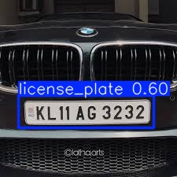

# License Plate Detector🥸
This project uses [OpenCV](https://opencv.org/), [Matplotlib](https://matplotlib.org/), [EasyOCR](https://github.com/JaidedAI/EasyOCR), and a [YOLO (Ultralytics)](https://github.com/ultralytics/ultralytics) object detection model from Ultralytics to detect vehicle license plates from images or video frames.
Once a license plate is detected, the project extracts the alphanumeric license number using OCR and identifies the Indian state/region of registration based on the first two characters of the plate (e.g., AP → Andhra Pradesh).

🛠️ Tech Stack  
- OpenCV — Computer vision library for image processing
- Matplotlib — Plotting and visualization library
- EasyOCR — Optical character recognition tool  
- YOLO (Ultralytics) — Object detection model


  
## Dependencies
#### The License plate Detector needs to be downloaded from [this repository](https://github.com/JaidedAI/EasyOCR).

## Project Setup
* Make an environment with conda using the following command
  
  ```bash
  conda create -n lp_pipeline python=3.12.11

* Activate Environment

  ```bash
  conda activate lp_pipeline
  
* Install the project dependencies using the following command
  
  ```bash
  pip install -r requirements.txt

* Run run.py to get the output

  ```bash
  python run.py


## Results 

* ### License Plate Detection:   
  The system detects the license plate on the vehicle and highlights it with a bounding box:  

    

* ### OCR Extraction:    
  The detected license plate is processed using EasyOCR to extract the alphanumeric text:  

* ### State Identification:  
  Based on the first two characters of the plate number, the system identifies the corresponding Indian state:  
  Example: KL 07 AB 1234 → Kerala  

* ### Output:  
  The car belongs to Kerela state  

